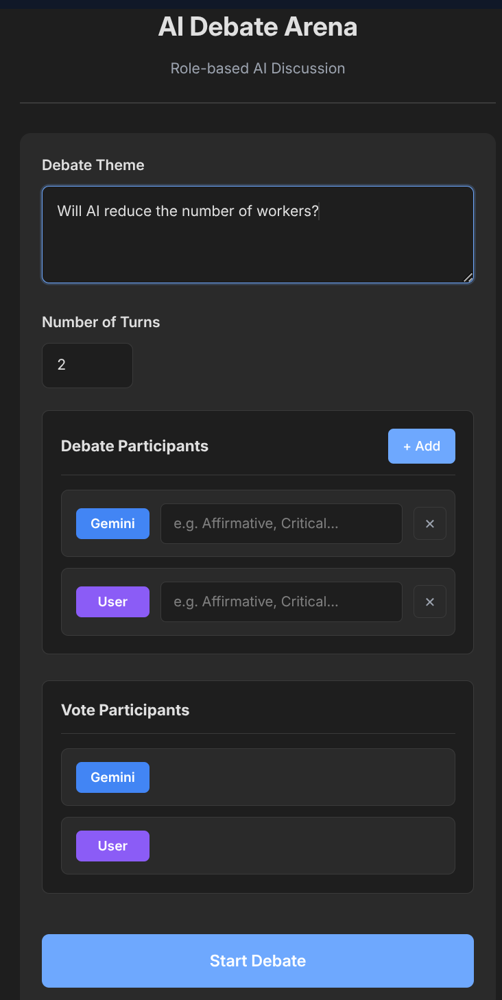
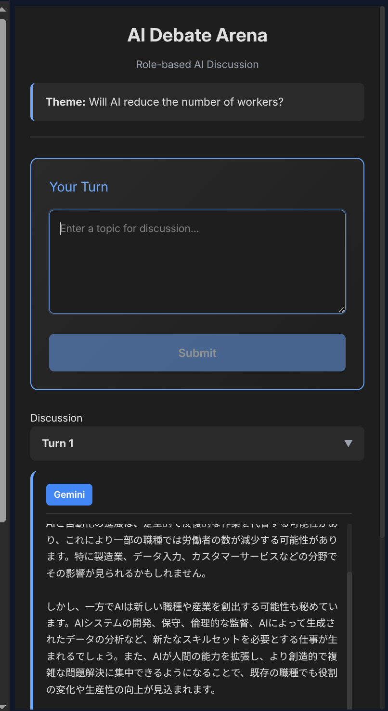
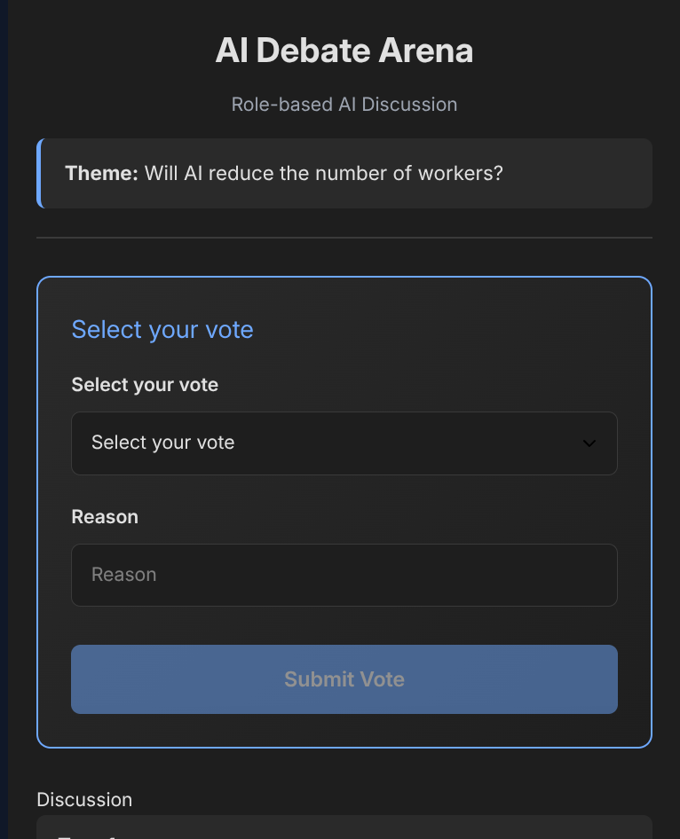
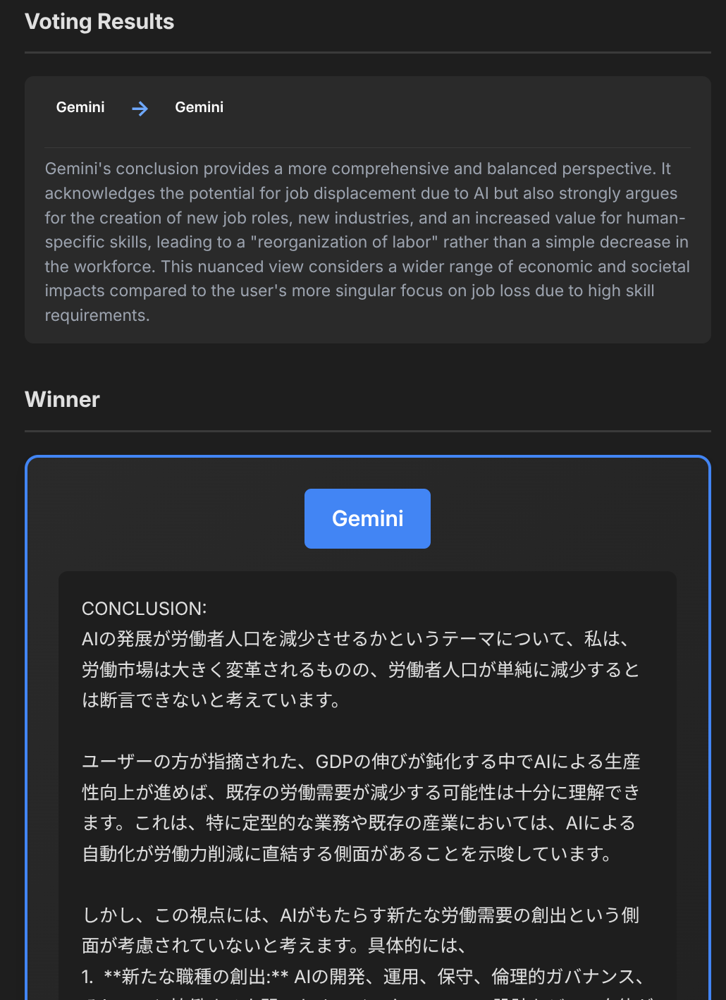

# Ronginus - GemiHub 用 AIディベートプラグイン

Ronginus は [GemiHub](https://github.com/takeshy/gemihub)／GemiHub Desktop共通プラグインで、異なる役割を持つ複数の Gemini AI 参加者による構造化されたディベートを実現します。参加者はテーマについてターン制で議論し、結論を出した後、最も優れた結論に投票します。

## 特徴

- **役割ベースの議論**: 各参加者に役割（例：「肯定派」「批判派」）を割り当て可能。同じ Gemini モデルが異なる視点で複数回参加できます。
- **ユーザー参加**: AI 参加者と一緒に自分もディベートに参加できます。
- **ターン制の議論**: ターン数は1〜10で設定可能。各参加者はこれまでの全発言を確認してから回答します。
- **結論 & 投票**: 議論ターン終了後、各参加者が最終結論を提示し、全参加者が最も優れた結論に投票します。
- **Drive エクスポート**: ディベートの全文をMarkdownファイルとしてGoogle Driveに保存できます。
- **設定の永続化**: システム/結論/投票プロンプトはストレージAPIを通じてプラグインごとに保存されます。
- **i18n**: 英語・日本語対応（ブラウザのロケールから自動検出）。

## インストール

### GemiHubまたはGemiHub Desktop 0.8.1以降から

1. GemiHub の設定 > プラグインタブを開く
2. `takeshy/hub-ronginus` と入力してインストールをクリック
3. プラグインを有効化

両hostが同じGitHub Releaseを使用します。GemiHubは`main.js`を読み込み、GemiHub Desktopはrepository管理の`patches/gemihub-desktop.patch`を適用してactive projectへ議事録を保存します。

### ソースからビルド

```bash
git clone https://github.com/takeshy/hub-ronginus
cd hub-ronginus
npm install
npm run build
```

`main.js`、`styles.css`、`manifest.json`、`patches/gemihub-desktop.patch`が生成されます（GitHub Release用）。

## スクリーンショット

| セットアップ | ディスカッション | 投票 | 結果 |
|:---:|:---:|:---:|:---:|
|  |  |  |  |

## 使い方

1. インストール後、右サイドバーに **AI Debate** パネルが表示されます。
2. ディベートのテーマを入力します。
3. ターン数を設定します。
4. **参加者を追加** — Gemini または User を選び、役割を設定します（任意）。
5. **Start Debate** をクリックします。
6. AI 参加者が順番に回答を生成します。User として参加している場合は、入力を求められます。
7. 最終ターンでは、各参加者が結論を提示します。
8. 全参加者が最も優れた結論に投票します。
9. 勝者（または同点の場合は引き分け）が発表されます。
10. **Save to Drive** をクリックしてトランスクリプトをエクスポートできます。

## 設定

ディベートパネルの **Settings** セクションを展開してカスタマイズできます：

| 設定項目 | 説明 |
|---------|------|
| System Prompt | 全 AI 参加者に与える基本指示 |
| Conclusion Prompt | 最終ターンで結論を求める際に追加されるプロンプト |
| Vote Prompt | 投票フェーズ用のプロンプト（投票形式の指示は自動で追加されます） |

## プラグイン API の利用

このプラグインは以下の GemiHub Plugin API を使用しています：

- `api.registerView()` — ディベートパネルをサイドバービューとして登録
- `api.gemini.chat()` — 役割別のシステムプロンプト付きで Gemini にメッセージを送信
- `api.drive.createFile()` — ディベートのトランスクリプトを Google Drive に保存
- `api.storage.get/set()` — プラグインの設定を永続化

## 仕組み

```
テーマ入力 + 参加者選択
    |
    v
+------------------------------------+
|  ターン 1                          |
|  Gemini(役割A) -> Gemini(役割B)    |
|  -> User(役割C) -> ...             |
+------------------------------------+
    | (各参加者は過去の発言を参照)
    v
+------------------------------------+
|  ターン 2 ~ N-1                    |
|  過去の議論を踏まえた             |
|  より深い議論                      |
+------------------------------------+
    | (最終ターン = 結論)
    v
+------------------------------------+
|  最終ターン                        |
|  各参加者が最終結論を提示          |
+------------------------------------+
    |
    v
+------------------------------------+
|  投票フェーズ                      |
|  全参加者が最も優れた結論に投票    |
+------------------------------------+
    |
    v
勝者発表（同点の場合は引き分け）
```

## ライセンス

MIT License
